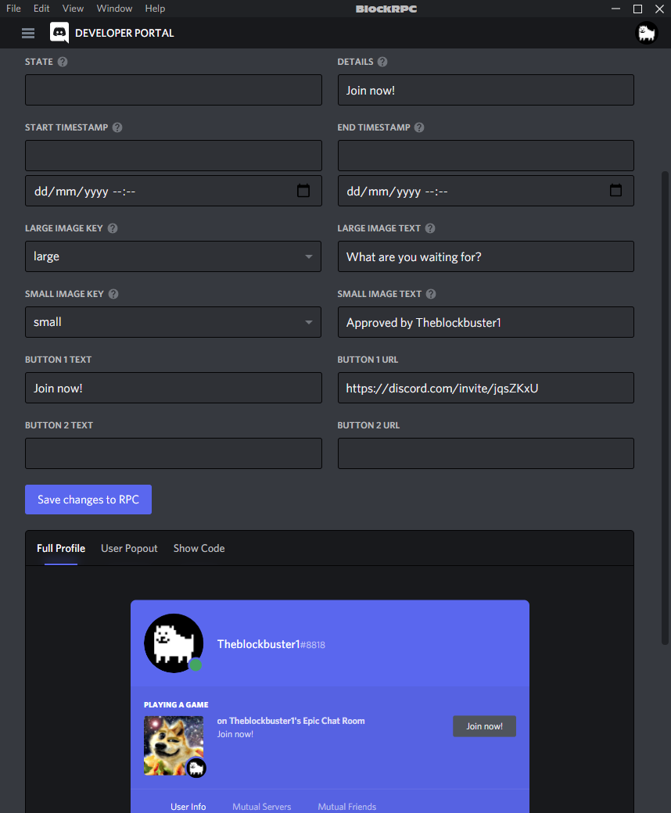

# BlockRPC

Made my own RPC client cause the other ones are kinda meh.

## Install
> Coming soon! (maybe)
## Install from source
0. Get [Node.js](https://nodejs.org/)
1. Clone the repository: `git clone https://github.com/Theblockbuster1/BlockRPC`
2. Install the dependencies: `npm i`

To run just use `npm start`, feel free to make a shortcut or something.

## Info
- The app basically opens the Discord Developer Portal, where you can choose or create a Rich Presence application, with a live preview.
- Press the `X` button to minimise to the tray, and there you can exit the app or reopen the window by right clicking.

## To-do
- Add (disableable) notifications to indicate that the app has been minimised to the tray.
- Compile into executables for easier installation and convenience.